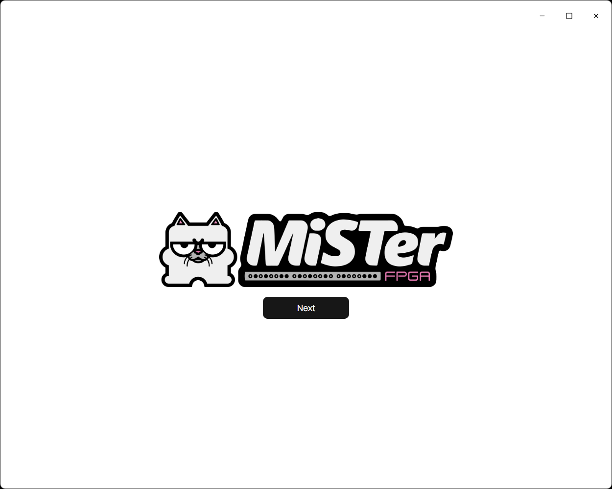
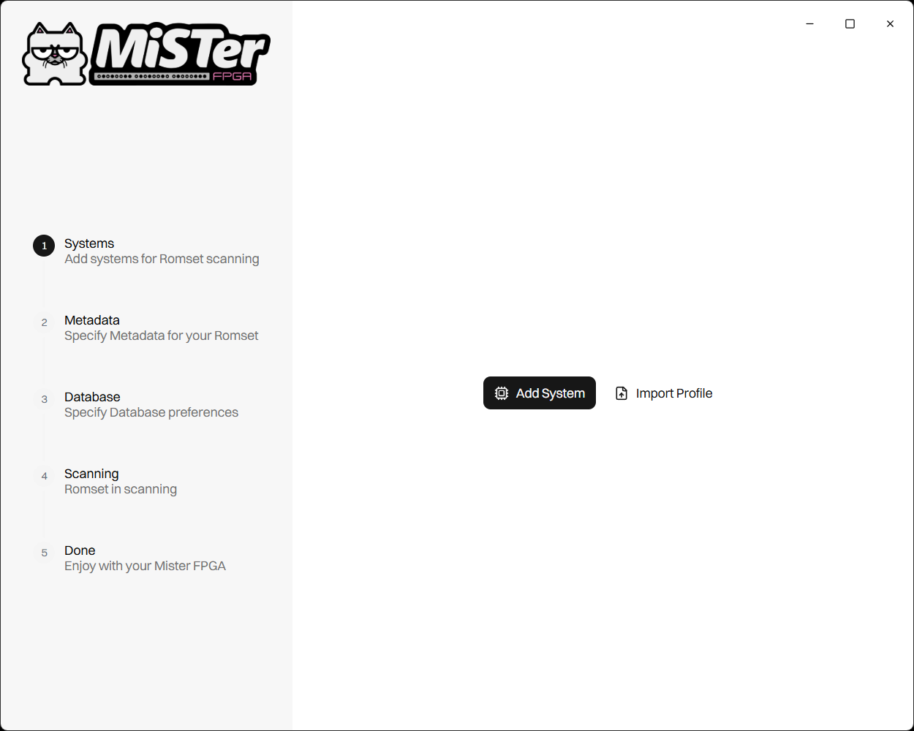
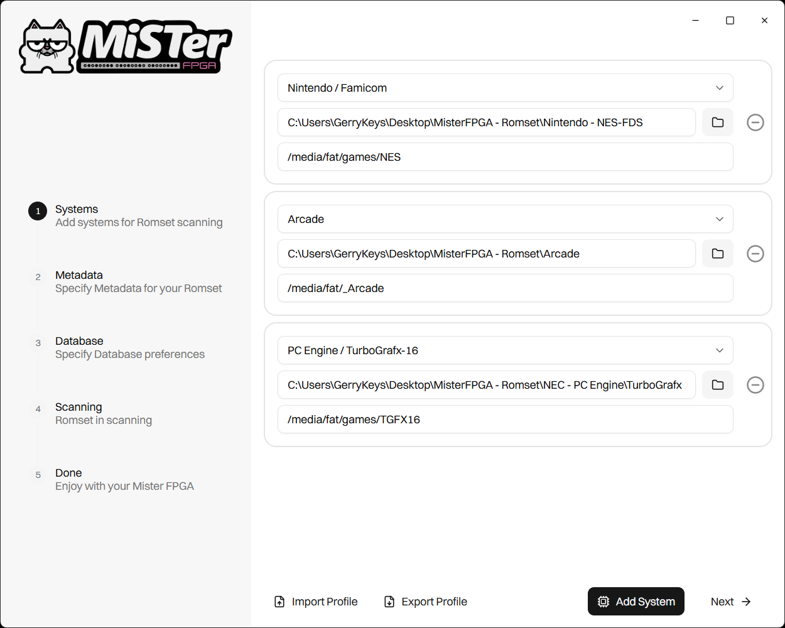
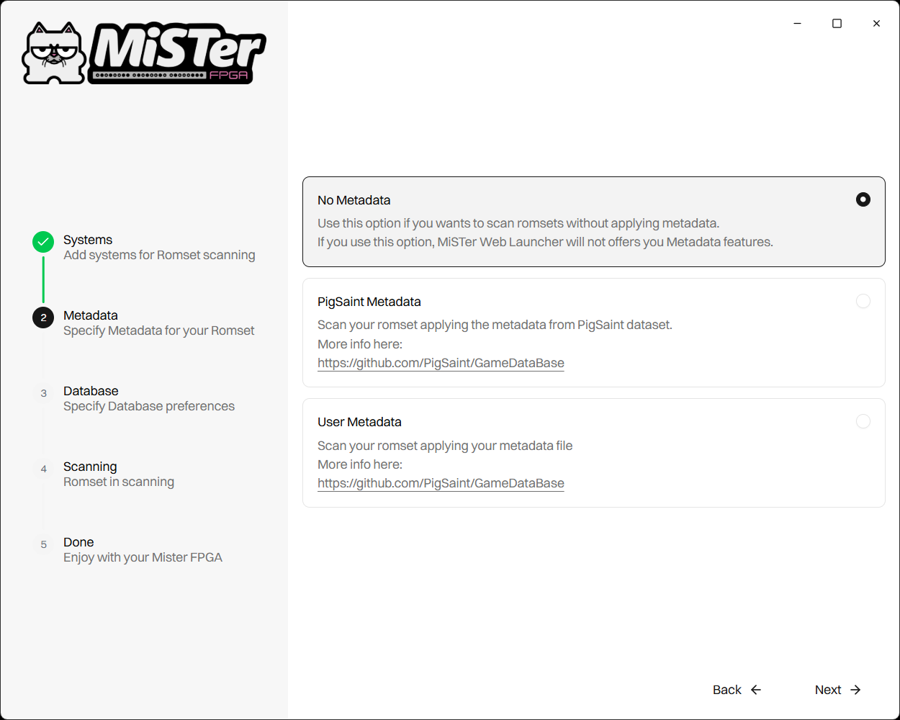
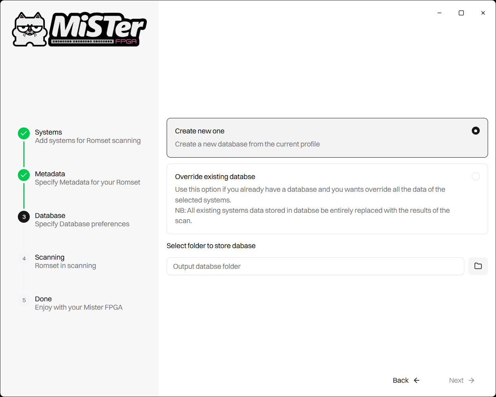
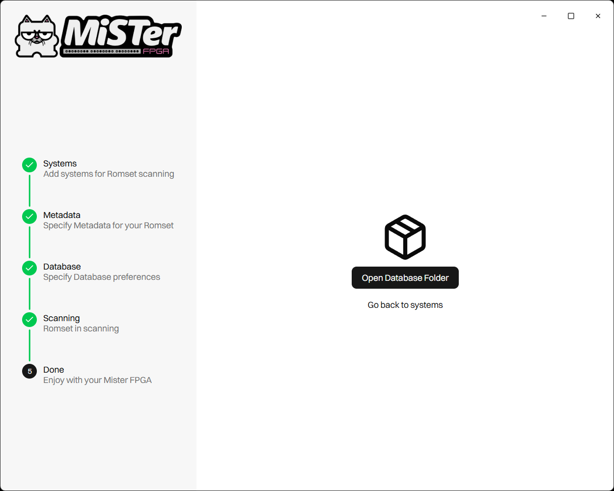

# MiSTer FPGA - Smart Scanner

## Overview
**MiSTeR FPGA - Smart Scanner** is a tool which let you generates a database of your
romsets that can be explored using **MiSTer FPGA - Smart Launcher** web application. 
You can found more info about the web-app [here](https://github.com/gerrykeys/MiSTer-FPGA_Smart-Launcher).

## OS Compatiblity
The tool is written to be cross-platform, but at the moment only the Windows x64 version is available.

## Suported Systems
The followings systems are supported (More systems will be available in future)

| Systems                         | Core (RBF)            | Supported formats                                 |
| --------------------------------|:---------------------:|:-------------------------------------------------:|
| Amiga                           | _Computer/Minimig     | .adf                                              |
| Amstrad                         | _Computer/Amstrad     | .dsk .e?? .cdt                                    |
| Apple II                        | _Computer/Apple-II    | .nib .dsk .do .po .hdv                            |
| Arcade                          | _Arcade/cores         | .mra                                              |
| Atari 2600                      | _Console/Atari7800    | .a78 .a26 .bin                                    |
| Atari 5200                      | _Console/Atari5200    | .car .a52 .bin .rom                               |
| Atari 7800                      | _Console/Atari7800    | .a78 .bin                                         |
| Atari 800                       | _Computer/Atari800    | .atr .xex .atx .xfd .car .rom .bin                |
| Atari Lynx                      | _Console/AtariLynx    | .lnx .lyx                                         |
| Coleco Vision                   | _Console/ColecoVision | .col .bin .rom                                    |
| Commodore 64                    | _Computer/C64         | .d64 .g64 .t64 .d81 .prg .crt .reu .tap           |
| Commodore VIC20                 | _Computer/VIC20       | .d64 .g64 .prg .crt .ct? .tap .rom                |
| Nintendo Game Boy               | _Console/Gameboy      | .gb                                               |
| Nintendo Game Boy Advance       | _Console/GBA          | .gba                                              |
| Nintendo Game Boy Color         | _Console/Gameboy      | .gbc                                              |
| Sega Genesis                    | _Console/Genesis      | .bin .gen .md                                     |
| Sega Master System              | _Console/SMS          | .sms                                              |
| Sega Mega Drive                 | _Console/MegaDrive    | .bin .gen .md                                     |
| MSX 1                           | _Computer/MSX1        | .rom                                              |
| Neo Geo                         | _Console/NeoGeo       | .neo                                              |
| Nintendo / Famicom              | _Console/NES          | .nes                                              |
| Nintendo 64                     | _Console/N64          | .z64 .n64                                         |
| Sony Playstation                | _Console/PSX          | .cue .bin .img .chd                               |
| Sega Saturn                     | _Console/Saturn       | .cue .bin .img .chd                               |
| Sega Mega CD                    | _Console/MegaCD       | .chd                                              |
| Super Nintendo / Super Famicom  | _Console/SNES         | .sfc                                              |
| Spectrum                        | _Computer/ZX-Spectrum | .trd .img .dsk .mgt .tap .csw .tzx .z80 .sna .vhd |
| PC Engine / Turbo Grafx16       | _Console/TurboGrafx16 | .bin .pce                                         |
| PC Engine CD / Turbo Grafx16 CD | _Console/TurboGrafx16 | .cue .bin .img .chd                               |
| Vectrex                         | _Console/Vectrex      | .vec .bin .rom                                    |
| Sharp X68000                    | _Computer/X68000      | .d88 .hdf .ram                                    |

## Roms in .Zip archive
ROMs with compatible extensions and compressed in .zip format are supported. 
Generally, MiSTer cores do not support the .zip format.
However, when MiSTer is used through the native UI interface, it can browse archives as if they were folders and allows selecting the ROM to launch.
When this happens, MiSTer handles unpacking the ROM and provides it as input to the relevant core.

The **MiSTer FPGA – Smart Launcher** application therefore handles the unpacking of zip files in the same way. 
For further info [here](https://github.com/gerrykeys/MiSTer-FPGA_Smart-Launcher)

# How to generate database

## System selection

After clicking on next button we will need to select the ROM sets that we want to scan.

It is possible to add all supported systems and also export a profile file.
The profile file can be imported later if you want to perform a new scan.
and thus recover the configuration of the systems previously added.

### Romset Input Folder and Mister FPGA romset folder
It is important to select the correct paths so that the ROMs can be run without issues. 
The root path of the folder containing the ROMs to be scanned must follow the same folder structure of the the root folder where the specific romset is placed in MiSTer FPGA.

## Metadata

The tool offers the possibility to associate a series of metadata with a ROM.  
You have three options here:

- **No Metadata**: Select this option if you wants skip this step. Remember that if a romset has no metadata, the filtering feature in Smart Launcher will not be available
- **PigSaint**: You can download and use CSV metadata files from PigSaint dataset. More info  [here](https://github.com/PigSaint/GameDataBase).
- **User**: You can provide your own CSV file containing the metadata. You can download the CSV template file from this repository.

### User Metadata (TAGS)
The CSV file includes a column called TAGS. 
In this column you can define all your custom metadata for the specific ROM. 
Its value must follow the same convention used by PigSaint dataset. You can find more information [here](https://github.com/PigSaint/GameDataBase)

The following table list all the user csv files with associated system

| Systems                        | USER CSV FILENAME     |
| ------------------------------ |:---------------------:|
| Arcade                         | arcade.csv            |
| Neo Geo                        | neogeo.csv            |
| Nintendo / Famicom             | nes.csv               |
| Nintendo 64                    | nintendo_64.csv       |
| Nintendo Game Boy              | gameboy.csv           |
| Nintendo Game Boy Advance      | gameboy_advance.csv   |
| Nintendo Game Boy Color        | gameboy_color.csv     |
| Sega Master System             | master_system.csv     |
| Sega Mega Drive                | mega_drive.csv        |
| Sega Genesis                   | genesis.csv           |
| Super Nintendo / Super Famicom | snes.csv              |
| PC Engine / Turbo Grafx16      | turbo_grafx16.csv     |

## Generate Database

The generated data consists in a folder called `database`. 
Inside this folder, there is an `index.db` file and a `data` folder. 
If you choose the **"Override Existing Database"** option, you will need to select the `index.db` file. 
The scan results will then update the existing database.

# Where to copy the databse folder

You can move the `database` folder inside the installation folder of the **MiSTer FPGA Smart Launcher**: 
`/media/fat/Scripts/MiSTer-Smart-Launcher`

